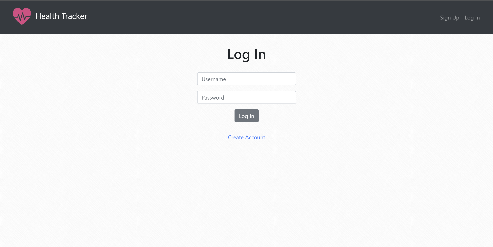
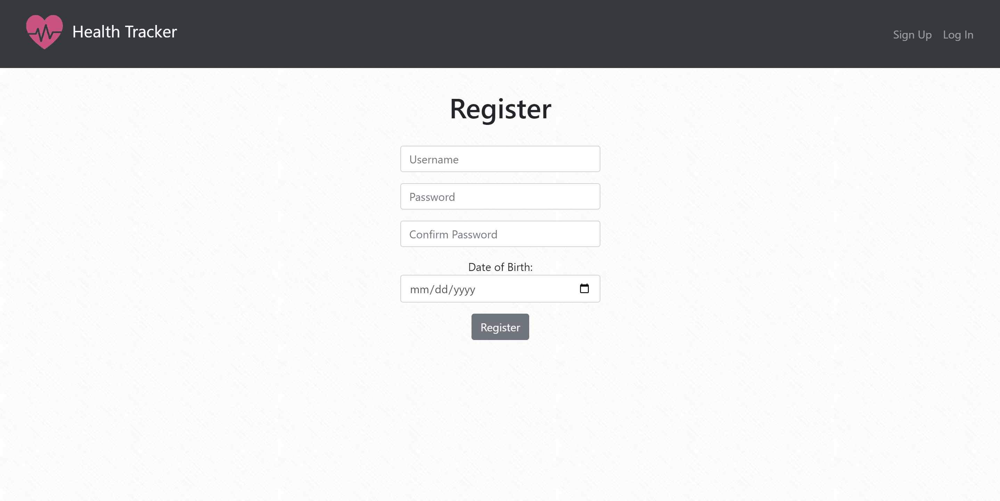
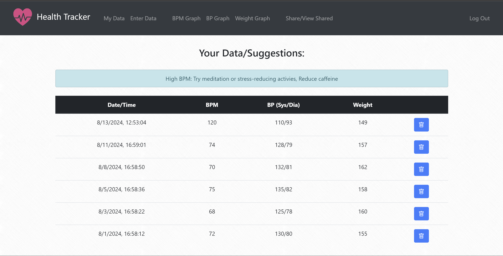
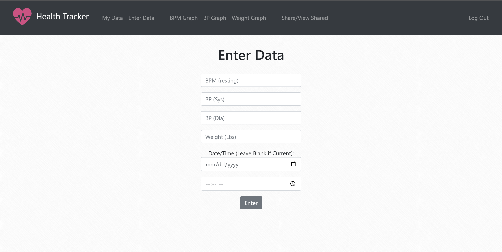
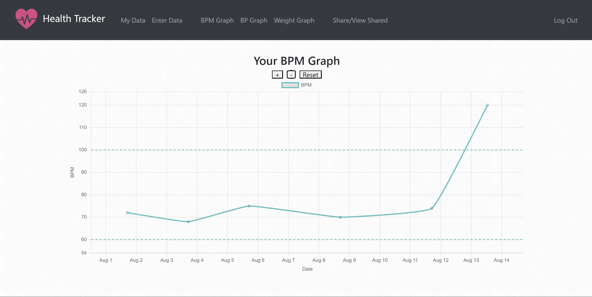
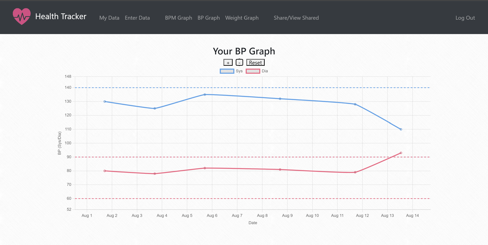
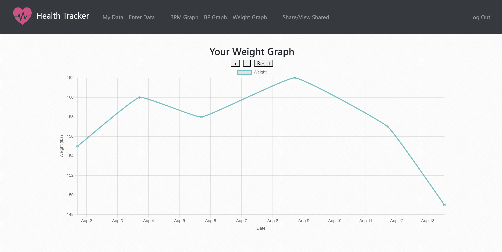
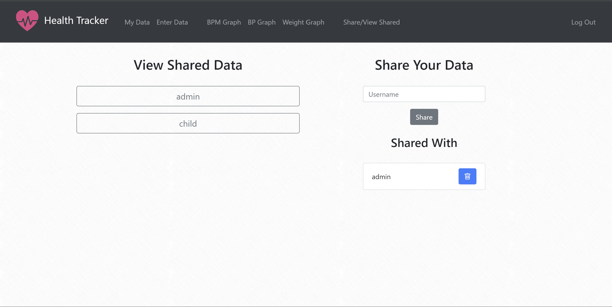
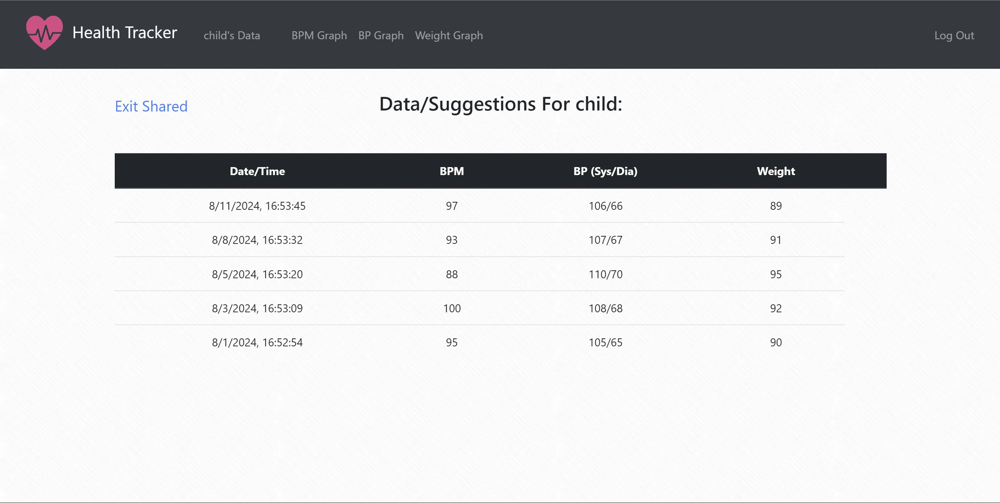
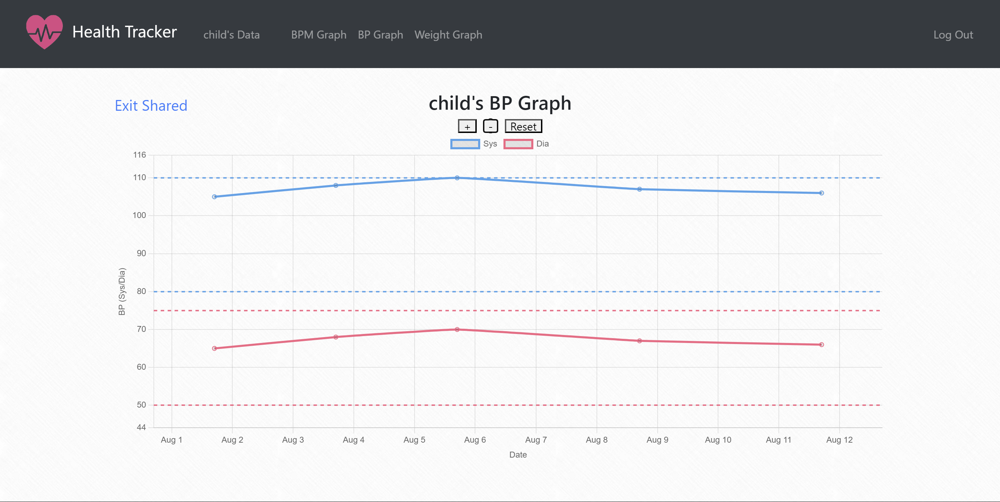

# Health Tracker


### Publicly Accesible at: https://healthtracker-76wq1tcx.b4a.run


#### Video Demo: https://youtu.be/YH6oQK4MkV0


## Description: 
Health tracker is a web application that allows users to log and track important health metrics while recieving tailored health advice. Users can create an account and log health data (BPM, BP, Weight). They can then view this data as a table or graphically and recieve health advice based on their age and most recent data. Users can also share their data with each other, enabling others to view their log.


## Technologies Used:
**Flask** - Primary Python microframework

**SQLite3** - Database

**Bootstrap 4** - Front-end styling framework

**ChartJS** - Interactive Graphs

**Jinja2** - Templating, If statements, For loops, and Variables in HTML


## How to Use:

### Login:
Upon visiting the website, you will be prompted to log in. If you have an account, enter your username and password and click log in. If your credentials are valid, you will be redirected to your "My Data" page. If you don't have an account, click "Sign Up" in the top right or click "Create Account" under the password field



### Register:
To create an account, choose a unique username, choose a password, retype the password in the confirm box, enter your date of birth, and click register. You will then be redirected to the login page where you can log in.



### My Data:
Here, you can view your records/suggestions. You can delete records by clicking the blue "trash" icon next to each record



### Enter Data:
Here, you can log your health data. You can enter your resting heartrate (bpm), your systolic and diastolic blood pressure, and your weight. You can also enter the date and time of measuring. If you leave this blank, it will default to the current date and time. Submit your data by clicking the gray "Enter" button.



### Graphs:
You can view your BPM, BP, and Weight data as graphs. The graphs are interactive, allowing you to zoom in and out with the "+" and "-" buttons or your scroll wheel and pan by clicking and dragging. For the BPM and BP graphs, you will see dotted lines that represent the healthy range for your age.





### Sharing:
In the Share/View Shared Tab, you can share your data with other users and view data that has been shared with you. On the right, Start sharing with a user by entering their username in the "Username" box and clicking "Share". You can stop sharing with users by clicking the blue "trash" icon next to their username in the list below. On the left, you can view users who are sharing their data with you. To view their data, click on their username in the list and you will be redirected to their data.



### Viewing Shared Data:
Once you have selected a user from your shared list, you will be taken to the shared data page where you can view their records. At any time, you can click "Exit Shared" to go back to your own page. You can also navigate to and view the user's graphs.





## How it Works:

### Python:

#### **app.py**:
app.py is the main Flask app and contains the routes and backend logic behind Health Tracker. Behind the scenes, it manages logging in, registering, entering and pulling data, and error handling by processing user input, interacting with the SQLite database and utilizing Flask's tools.

#### **helpers.py**:
helpers.py contains important functions that allow Health Tracker to calculate a user's age, generate suggestions, and determine age-specific healthy ranges.


### HTML:

#### **layout.html**:
layout.html provides the main layout that is utilized by all of the other html files using Jinja2's template syntax. layout.html includes links for all of the required JS and CSS libraries, the structure of the navbar, a Jinja2 for loop to display flashed messages with different colors depending on their type, and title and main Jinja2 blocks that are filled in the other html files.

#### **login.html**:
login.html is the first page users see when they visit Health Tracker. It has a form that takes a user's username and password and passes it to app.py's "/login" route, where the credentials are checked against the database's 'users' table. 


#### **register.html**:
register.html is what user's see when creating an account. It has a form that takes a user's desired username, new password, a confirmation of the password, and the user's date of birth. It passes this information to app.py's "/register" route and if all goes well, the information is inserted into the database's 'users' table.


#### **index.html**:
index.html is where the user is redirected after logging in. It displays the user's suggestions as flashed messages, which are based off of their most recent entry, and a table of all of their records from the database's 'records' table, with each row being generated by a Jinja2 for loop. Each record has a hidden form with a delete button which passes the record's id to app.py's "/delete_entry" route and the record is deleted from the database's 'records' table.


#### **enter.html**:
enter.html is where the user enter's their data. It has a form that takes the user's resting BPM, systolic BP, systolic Dia, and weight (all of which are limited to realistic ranges to prevent bogus data), and the date and time the measurements were taken. This information is passed to app.py's enter route which validates the data and inserts it into the database's 'records' table.


#### **bpm_graph.html, bp_graph.html, weight_graph.html**:
bpm_graph.html, bp_graph.html, and weight_graph.html are very similar in design, with adjustments based on the data they display. They utilize Chart.js to display interactive graphs that allow zooming in panning. They all have "+" "-" and "Reset" buttons that zoom in, zoom out, and reset the zoom/position of the graph respectively. Javascript was utilized to add additional functionality to the x-axis of the graphs. As the user zooms in, the x axis gets more and more descriptive and vice versa, transitioning from showing years, to years/months, to full dates, to dates and times. Because he same html files are used to show graphs of shared users' data, besides being passed different datasets, there is also a "Exit Shared" button, which redirects the user to "/shared", and therefore back to their own page, that only appears when in shared mode. This logic is handled by a Jinja2 if statement.

The BPM graph and BP graph have static dotted lines that represent the healthy ranges of each measurements. The healthy ranges are dependent on the user's age, so they are different for users of different age ranges.


#### **share.html**:
share.html is where users manage who they are sharing with and access shared data.

On the right, it contains a form where users can input a username they would like to share with. The "Share" button passes this username to app.py's "/share" route. If the username is valid and not yet being shared with, the logged in user's id and the entered user's id are inserted into the databases 'shared' table. Under the form, there is a list of usernames that are being shared with, created by a Jinja2 for loop, each with a hidden form and a delete button which passes the id of the shared user to app.py's "/unshare" route which deletes the corresponsing sharing relationship from the database's 'shared' table.

On the left, it contains a list of buttons, generated by a Jinja2 for loop, which display usernames who share their data with the current user. Clicking on a button sends the sharing user's id to app.py's "/shared_data" route where the sharing user's information is stored in the Flask Session. The user is then redirected to shared_data.html.


#### **shared_data.html**:
shared_data.html is where users view data, in table form, shared by other users. All of the sharing user's suggestions are displayed at the top as flashed messages. The table, just like in index.html, displays rows of data from the database's 'records' table, generated by a Jinja2 for loop, however there is no delete button, as only the owner can delete records. There is also an "Exit Shared" button which redirects the user to "/shared", and therefore back to their own page.


## Local Installation:
To use Health Tracker, you can visit this URL: https://healthtracker-76wq1tcx.b4a.run or install/run it locally

### Prerequisites:
- Python 3.12

### Linux Instructions:
1. **Install Docker:**  
   If you don't have Docker installed, follow the [official Docker installation guide](https://docs.docker.com/get-docker/) to get it set up on your system.

2. Clone the repository:
    ```
    git clone https://github.com/yourusername/Health-Tracker.git
    ```

3. Build the docker image:
    ```
    docker build -t your-image-name .
    ```

4. Run the Docker Container:
    ```
    docker run -p 8000:8000 your-image-name
    ```

5. Access the webapp:
    Open your browser and go to 'http://127.0.0.1:8000'.

    Others on your network can access it at 'http://youripaddress:8000' if your firewall allows it


### Windows Instructions:
1. Clone the repository:
    ```
    git clone https://github.com/yourusername/Health-Tracker.git
    ```

2. Navigate to the project directory:
    ```
    cd Health-Tracker
    ```
3. Install the required packages:
    ```
    pip install -r requirements.txt
    ```
4. Run the Flask application:
    ```
    flask run --host=0.0.0.0
    ```
5. Access the webapp
    Open your browser and go to 'http://127.0.0.1:5000'.
    
    Others on your network can access it at 'http://youripaddress:5000' if your firewall allows it
